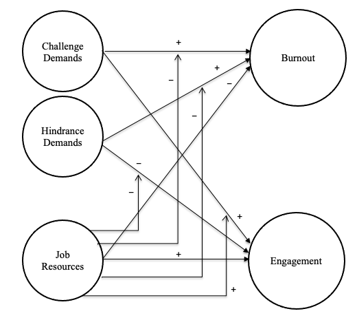
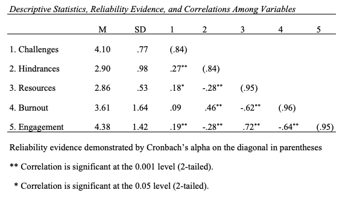
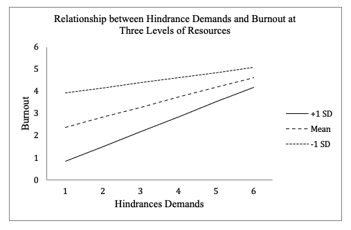
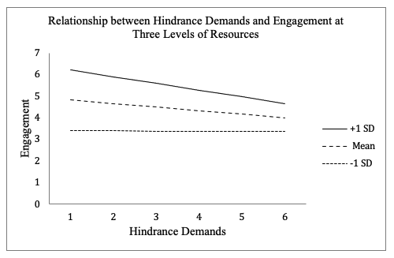

# Burnout-and-Engagement-Study
A moderated hierarchical regression analysis testing a differentiated model of job demands and their relation to resources, burnout, and engagement using Amazon Mechanical Turk and SPSS Statistics

## Overview
This repository highlights excerpts from my doctoral dissertation in Organizational Psychology. The abstract provides an overview of the study and I have also included some visualizations, statisical summaries and some high level findings as well as interpretations. 

## Abstract
Work engagement and burnout have been researched extensively through the Job Demands-Resources (JD-R) stress framework; however, there are still relationships within the model that are not fully understood.  Historically, job demands have been considered to be one homogenous group having similar relationships with resources, burnout and engagement.  Researchers have found that job demands have been consistently positively related to burnout, and job resources have been positively related to engagement.  Associations between job demands and engagement have been shown to be positive, negative, non-existent, as well as curvilinear (Bailey, Madden, Alfes, & Fletcher, 2015).  However, job demands may be differentiated into challenges, which may actually be less harmful for workers, and hindrances, which may account for the majority of the negative association with burnout.  Although a small amount of primary research has investigated demands differentiated into challenges and hindrances with samples outside of the U.S., no studies to date have investigated the relationship between challenge and hindrance demands with burnout and work engagement with a sample of employees in the U.S.  Additionally, very little research has studied the interaction effects within a differentiated demands model on burnout and work engagement.  In this study, a moderated hierarchical regression analysis was used to explore the relationships among challenge demands, hindrance demands, resources, burnout, and engagement with a sample of knowledge workers in the U.S. sourced through the Amazon Mechanical Turk system.  Overall, hindrance demands were found to be positively related to burnout and negatively related to engagement.  Challenge demands were not significantly related to burnout but were positively related to engagement.  The interactive effects of job resources were only observed for the hindrance demand relationships.  The differentiated model of job demands may provide a clearer understanding of the different mitigating and boosting relationships between challenges, hindrances, and resources.  The results of this study suggest that for executives who wish to increase the positive outcomes associated with well-being, they may want to focus on reducing hindrance demands and increase access to resources across their organizations.

Figure 1. The Job Demands - Resources model shown with demands differentiated into job challenges and job hindrances

## Results
Table 1. Summary Statistical Relationships

### Analysis
Hypothesis 1 stated that both job challenge demands and job hindrance demands would have a positive relationship with burnout, but job hindrance demands would be more strongly related to burnout than would job challenge demands.  Results indicated that challenge demands were positively, but not statistically significantly related to burnout (B = .18, p = .25).  Hindrance demands were positively and statistically significantly related to burnout (B = .79, p = .001).  When hindrances were added in step two, a significant amount of burnout variance was explained over and above that explained by challenges alone (ΔR2 = .21, F(2,180) = 24.64, p < .001).  Hindrances explained more variance (21%) in burnout than did challenge demands (.8%) as shown by the semi-partial correlations. Therefore, Hypothesis 1 was partially supported in that: (a) although challenge demands were not significantly related to burnout, there was a weak positive relationship; (b) hindrances were positively and significantly related to burnout; and (c) hindrance demands were more strongly related to burnout than were challenge demands. 

## Interaction Investigations

#### Figure 2. The interaction of hindrance demands and three levels of resources on burnout

### Analysis
Hypothesis 9 stated that job resources would moderate the positive relationship between job hindrance demands and burnout such that the relationship between hindrance demands and burnout would be weaker in the presence of higher job resource levels compared to lower job resource levels.  The interaction between hindrance demands and resources had a positive and significant relationship with burnout (B = .41, p < .05).  A simple slopes analysis was conducted to further investigate the interaction relationship at three levels of perceived resources; scores less than one standard deviation below the mean, the mean range, and scores greater than one standard deviation above the mean (Figure 2).  When perceptions of resources were low (- 1 SD) the relationship between job hindrances and burnout was positive and not statistically significant (B = .24, p = .067).  When perceptions of resources were in the average range, hindrances had a positive and significant relationship with burnout (B = .45, p < .001).  When perceptions of resources were high (+1 SD) the relationship between hindrances and burnout was positive and statistically significant (B = .67, p < .001).  Support for Hypothesis 9 was mixed; although resources moderated the relationship between hindrance demands and burnout, the form of the interaction was not as predicted. Specifically, Hypothesis 9 stated that the relationship between hindrance demands and burnout would be weaker in the presence of higher job resource levels compared to lower job resource levels.  However, this pattern was not found.  Instead, the relationship between hindrance demands and burnout was actually greater in the presence of higher job resource levels compared to lower job resource levels when hindrances were perceived to be higher.  Burnout levels were only lower when resource levels were perceived to be in average or higher ranges and hindrances were perceived to be lower.  

#### Figure 3. The interaction of hindrance demands and three levels of resources on engagement

### Analysis
Hypothesis 10 stated that job resources would moderate the negative relationship between job hindrance demands and work engagement such that the relationship between hindrance demands and work engagement would be weaker in the presence of higher job resource levels compared to lower job resource levels.  The results indicated that the interaction of hindrances and resources was negatively and significantly related to engagement (B = - .28, p < .05).  A simple slopes analysis was conducted to further investigate the interaction relationship at three levels of perceived resources; scores less than one standard deviation below the mean, the mean range, and scores greater than one standard deviation above the mean (Figure 3).  When perceptions of resources were low (- 1 SD), job hindrances were positively and not significantly related to engagement (B = -.008, p = .94).  When perceptions of resources were in the average range, hindrances had a negative and significant relationship with engagement (B = - .16, p < .05).  When perceptions of resources were high (+1 SD) the relationship between hindrances and burnout was negative and statistically significant (B = - .32, p < .05).  
	Support for Hypothesis 10 was mixed; although resources moderated the negative relationship between hindrances and engagement, the form of the interaction was not as predicted. Specifically, Hypothesis 10 stated that the relationship between hindrance demands and engagement would be weaker in the presence of higher job resource levels compared to lower job resource levels.  However, this pattern was not found. Instead, the negative relationship between hindrance demands and engagement was actually stronger in the presence of higher job resource levels compared to lower job resource levels when hindrances were perceived to be higher.  Engagement levels were only higher when resource levels were perceived to be in average or higher ranges and hindrances were perceived to be lower.

## Discussion
This study sought to contribute more primary research to the thin body of literature that differentiates job demands into job hindrances and job challenges.  Specifically, the purpose was to gain further understanding of the relationships among these work conditions with job resources, burnout, and engagement.  The interactive effects of job challenges and job hindrances with job resources on both engagement and burnout were also analyzed, which previously had not yet been done (Tadić et al., 2015; Yuan et al., 2015).  Classic models of job stress have assumed that all job demands have negative effects on people.  In general, the results of this study support the argument that job demands are not one homogeneous construct and that differentiating them into challenges and hindrances would be appropriate when analyzing relationships among workplace characteristics.  These results suggest that job challenges may contribute to workplace engagement while job hindrances are the greatest contributor to burnout. 

Results from this study also suggest that even when employees perceive resources to be available (e.g. autonomy, social support, manager support) there may not necessarily be a buffering effect on job demands.  That is, hindrances potentially affect employee engagement and burnout even when resources are perceived to be present.  Also, an increase in job resources may not boost the positive relationship between challenges and engagement.  Resources may not have a strong enough effect on workers that are experiencing high levels of hindrances.  With this in mind, managers should concentrate efforts on reducing hindrance demands first, and maintaining some level of resources second in order to increase engagement and decrease burnout in their employees.  Often, organizations concentrate their engagement efforts on identifying work condition factors that promote engagement and then attempt to increase or improve those factors.  It may also be beneficial to measure those work conditions such as hindrances that detract engagement and then focus on removing or minimizing those obstacles in order to decrease burnout and improve employee engagement. 
